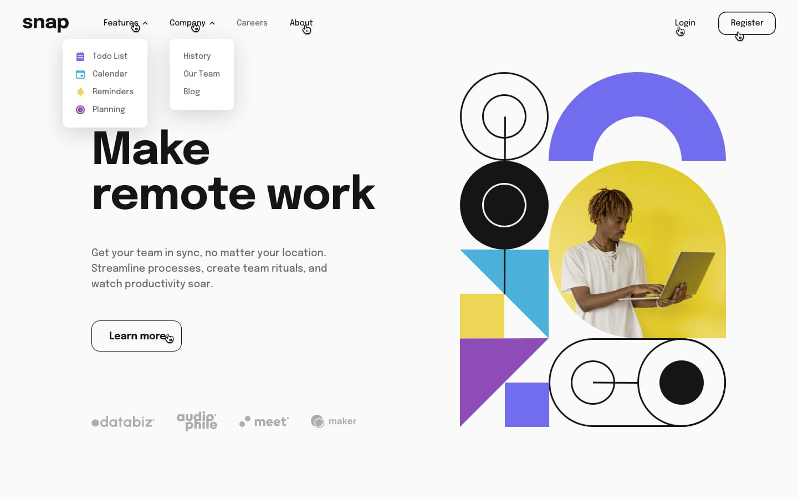

# Frontend Mentor - Intro section with dropdown navigation


This is a solution to the [Intro section with dropdown navigation challenge on Frontend Mentor](https://www.frontendmentor.io/challenges/intro-section-with-dropdown-navigation-ryaPetHE5). Frontend Mentor challenges help you improve your coding skills by building realistic projects. 

## Table of contents

- [Overview](#overview)
  - [The challenge](#the-challenge)
  - [Screenshot](#screenshot)
  - [Links](#links)
- [My process](#my-process)
  - [Built with](#built-with)
  - [What I learned](#what-i-learned)
  - [Continued development](#continued-development)
  - [Useful resources](#useful-resources)
- [Author](#author)
- [Acknowledgments](#acknowledgments)
## Overview

### The challenge
Your challenge is to build out this intro section with dropdown navigation and get it looking as close to the design as possible.

Users should be able to:

- [x] View the relevant dropdown menus on desktop and mobile when interacting with the navigation links
- [x] View the optimal layout for the content depending on their device's screen size
- [x] See hover states for all interactive elements on the page

## Screenshots

### Desktop


### Mobile


### Active States



## Links

<!-- - Solution URL: [Add solution URL here](https://your-solution-url.com) -->
- Live Site URL: [live site](https://darling-boba-0cc95f.netlify.app/)

## My process

### Built with


- Mobile-first workflow
- [React](https://reactjs.org/) - JS library
- [Styled Components](https://styled-components.com/) - For styles


### What I learned
<!-- 
Use this section to recap over some of your major learnings while working through this project. Writing these out and providing code samples of areas you want to highlight is a great way to reinforce your own knowledge.

To see how you can add code snippets, see below:

```html
<h1>Some HTML code I'm proud of</h1>
```
```css
.proud-of-this-css {
  color: papayawhip;
}
```
```js
const proudOfThisFunc = () => {
  console.log('🎉')
}
``` -->


### Continued development

- animations
- `href` navigation
- `aria` attributes and accessiblility

### Useful resources

- [Responsive Background Images Using React Hooks🍍](https://itnext.io/responsive-background-images-using-react-hooks-941af365ea1f) => This helped me responsively render images based on the current device breakpoint.
- [CSS Overlay Techniques](https://tympanus.net/codrops/2013/11/07/css-overlay-techniques/) => to add overlay to all other content while the mobile dropdown menu is open

## Author

- Frontend Mentor - [@Chanda-Abdul](https://www.frontendmentor.io/profile/Chanda-Abdul)
- Website - [Chanda Codes](https://chandacodes.com/)
- GitHub - [github.com/Chanda-Abdul](https://github.com/Chanda-Abdul)


## Acknowledgments


